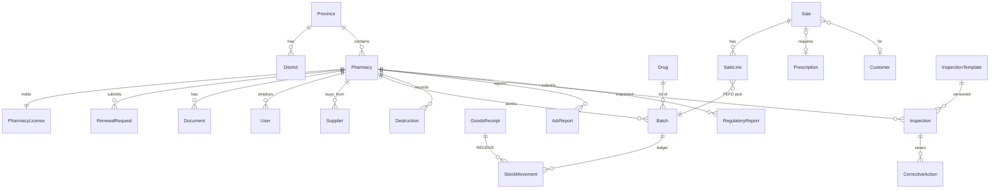

# Data model

```mermaid
erDiagram
  Province ||--o{ District : has
  Province ||--o{ Pharmacy : contains
  Pharmacy ||--|| PharmacyLicense : holds
  Pharmacy ||--o{ RenewalRequest : submits
  Pharmacy ||--o{ Document : has
  Pharmacy ||--o{ User : employs
  Pharmacy ||--o{ Supplier : buys_from
  Pharmacy ||--o{ Batch : stocks
  Drug ||--o{ Batch : "lot of"
  Batch ||--o{ StockMovement : ledger
  Sale ||--o{ SaleLine : has
  SaleLine }o--|| Batch : "FEFO pick"
  Sale |o--o| Prescription : requires
  Sale }o--o| Customer : for
  GoodsReceipt ||--o{ StockMovement : RECEIVE
  Pharmacy ||--o{ Destruction : records
  Pharmacy ||--o{ AdrReport : reports
  InspectionTemplate ||--o{ Inspection : versioned
  Pharmacy ||--o{ Inspection : inspected
  Inspection ||--o{ CorrectiveAction : raises
  Pharmacy ||--o{ RegulatoryReport : submits
```

Every record carries `id` (UUIDv7, client-generated), `createdAt`, `updatedAt`, `createdBy`, `version`, `deletedAt`.
Types live in `src/data/types.ts`.
